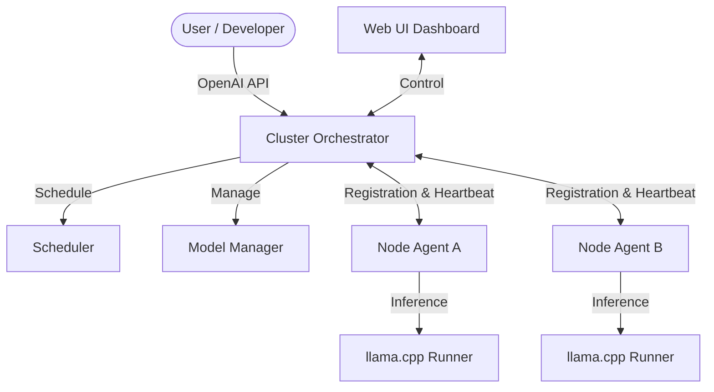

# 🧠 NeuronGrid

### The Private Local AI Cloud for the Modern Enterprise

[](LICENSE)
[](https://www.python.org/)
[](https://fastapi.tiangolo.com/)
[](https://nextjs.org/)

**NeuronGrid** transforms your local hardware—from Raspberry Pis to high-end GPU servers—into a unified, private AI compute cluster. Run large language models (LLMs) locally with the ease of Docker and the power of Kubernetes, all while keeping your data strictly within your network.

---

## 🚀 Key Features

- **🌐 Automatic Node Discovery:** Seamlessly join new devices to your cluster via LAN broadcast.
- **🛠️ Unified Compute Pool:** Combine heterogeneous hardware (CPU, RAM, GPU) into a single logical AI resource.
- **📦 Model Management:** Direct integration with HuggingFace for GGUF model downloads and distribution.
- **🔌 OpenAI Compatible:** Drop-in replacement for OpenAI API (`v1/chat/completions`).
- **🖥️ Minimalist Dashboard:** Modern Web-UI for monitoring cluster health, model deployments, and live chat.

---

## 🏗️ Architecture

NeuronGrid is built with a modular, distributed architecture designed for scalability and low latency.



### Core Components:
- **`cluster-core/`**: The "brain" of the operation. Handles state, scheduling, and API routing.
- **`node-agent/`**: The "muscle". Runs on every device to report hardware stats and execute LLM jobs.
- **`web-ui/`**: The "face". A sleek Electron/Next.js desktop application for management.

---

## 🛠️ Quick Start (MVP Phase 1)

### 1. Start the Orchestrator
```bash
cd cluster-core/orchestrator
python -m venv venv
source venv/bin/activate  # Windows: venv\Scripts\activate
pip install -r requirements.txt
python main.py
```

### 2. Start a Node Agent
```bash
cd node-agent/device-service
python -m venv venv
source venv/bin/activate  # Windows: venv\Scripts\activate
pip install -r requirements.txt
python main.py
```

---

## 🤝 Contributors

- **Nilabh** (@Nilabh2020) - Lead Engineer & Founder
- **Gemini CLI** - AI Co-founder & Core Architect

---

## 📜 License

**Commercial / Closed Source**
Copyright © 2026 NeuronGrid. All rights reserved.

---

*“Your hardware. Your data. Your AI Cloud.”*
